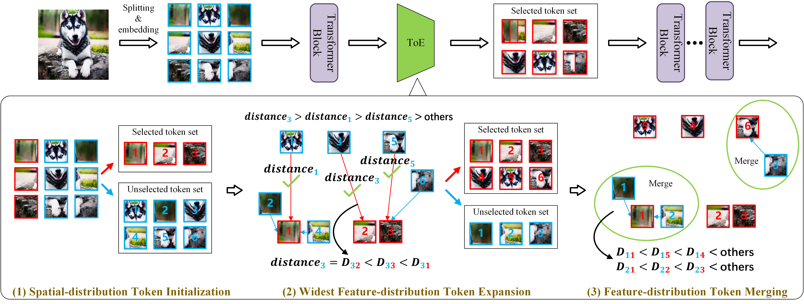

# TokenExpansion

The official pytorch implementation of Token Expansion (ToE).

[[arXiv (CVPR 2024)]](https://arxiv.org/abs/2404.00672)

## Update

- `2024.4.17` : Add the example of ToE apply for YOLOS on object detection.
- `2023.11.26` : Release code of ToE.

:fire: : We find that ToE has a significant effect for PEFT methods. For example, ToE can achieve **2x training speed** and **30% GPU memory saving** for the training of [Visual Prompt Tuning (VPT))](https://github.com/KMnP/vpt), while improving accuracy by 2%-6% on VTAB-1k benchmark. We will release the code soon. Stay tuned!

## Pipeline



The ''initialization-expansion-merging'' pipeline of proposed ToE.  We take the $1$st training stage ($\delta=1$), the kept rate $r_1=2r_0=\frac{2}{3}$, the repetition step $k=1$ as example. ToE is only added after the first Transformer block to guide the token selection and usage. During training, steps (1), (2), and (3) are performed for each iteration with the reduction of token numbers. First, seed tokens are selected for token initialization through step (1). Then, the number of tokens is expanded via step (2) for token expansion. Finally, we merge the unselected token set (blue boxes) into the selected one (red boxes) with the close feature distributions in step (3) for token merging. During testing, ToE can be safely removed to generate the same Transformer architecture as the original full-token Transformer.

## Requirements

```
torch>=1.12.0
torchvision>=0.13.0
timm==0.9.2
```

## How to apply ToE

We provide the main code `token_select.py`. It can be seamlessly integrated into the training of ViTs.

You can find the examples of applying ToE to popular ViTs (e.g., DeiT in `ToE/deit `and LV-ViT in `ToE/lvvit `) and existing efficient training frameworks (e.g., EfficientTrain in `ToE/EfficientTrain `).

It is simple to change the existing codes, and the codes for the changes we make to the original model codes are wrapped in two `# ---------------------#`. 

For example (`ToE/deit/main.py `):

```
 model = create_model(
     args.model,
     pretrained=False,
     num_classes=args.nb_classes,
     drop_rate=args.drop,
     drop_path_rate=args.drop_path,
     drop_block_rate=None,
     img_size=args.input_size,
 )
 # ---------------------#
 model.token_select = TokenSelect(
     expansion_step=args.expansion_step,
     keep_rate=args.keep_rate,
     initialization_keep_rate=args.initialization_keep_rate,
     expansion_multiple_stage=args.expansion_multiple_stage,
     distance=args.distance,
 )
 # ---------------------#

```

## Data prepare

### ImageNet-1k

Download and extract ImageNet images from http://image-net.org/. The directory structure should be:

```
│ILSVRC2012/
├──train/
│  ├── n01440764
│  │   ├── n01440764_10026.JPEG
│  │   ├── n01440764_10027.JPEG
│  │   ├── ......
│  ├── ......
├──val/
│  ├── n01440764
│  │   ├── ILSVRC2012_val_00000293.JPEG
│  │   ├── ILSVRC2012_val_00002138.JPEG
│  │   ├── ......
│  ├── ......
```

### COCO

Download and extract COCO 2017 train and val images with annotations from [http://cocodataset.org](http://cocodataset.org/). We expect the directory structure to be the following:

```
path/to/coco/
  annotations/  # annotation json files
  train2017/    # train images
  val2017/      # val images
```

### Label data for LV-ViT

Following [original LV-ViT repo](https://github.com/zihangJiang/TokenLabeling) to prepare.

We provide NFNet-F6 generated dense label map in [Google Drive](https://drive.google.com/file/d/1Cat8HQPSRVJFPnBLlfzVE0Exe65a_4zh/view?usp=sharing) and [BaiDu Yun](https://pan.baidu.com/s/1YBqiNN9dAzhEXtPl61bZJw) (password: y6j2). As NFNet-F6 are based on pure ImageNet data, no extra training data is involved.

## Pretrained model prepare

### Pretrained DeiT model for YOLOS

Following  [original YOLOS repo](https://github.com/hustvl/YOLOS) to prepare.

 [[FB] Pretrained model for YOLOS-T](https://dl.fbaipublicfiles.com/deit/deit_tiny_patch16_224-a1311bcf.pth)

 [[FB] Pretrained model for YOLOS-S](https://dl.fbaipublicfiles.com/deit/deit_small_patch16_224-cd65a155.pth)

## Training

The detailed training scripts are presents in the specific code paths (e.g., DeiT in in `ToE/deit/run/`). You should prepare the environments and datasets.

We take a few simple training examples:

### DeiT-small

We train the DeiT-small on four GPUs, the ImageNet-1K dataset is  required.

```
cd ToE/deit
bash run/imagenet_small_run1.sh
```

**run/imagenet_small_run1.sh**:

```
result_dir=[your_result_path]
dataset_dir=[your_dataset_path]
device=0,1,2,3
master_port=6666
CUDA_VISIBLE_DEVICES=$device torchrun --nproc_per_node=4 --master_port=$master_port main.py \
--patch-size 16 \
--model deit_small_patch16_224 \
--batch-size 256 \
--data-path $dataset_dir \
--output_dir $result_dir \
--num_workers 8 \
--seed 3407 \
--expansion-step 0 100 200 \
--keep-rate 0.5 0.75 1.0 \
--initialization-keep-rate 0.25 \
--expansion-multiple-stage 2 \
```

### LV-ViT-S

We train the LV-ViT-S on four GPUs, the ImageNet-1K dataset and the label data (see [original LV-ViT repo](https://github.com/zihangJiang/TokenLabeling)) are required.

```
cd ToE/lvvit
bash run/imagenet_small_run1.sh
```

**run/imagenet_small_run1.sh**:

```
#!/bin/bash
result_dir=[your_result_path]
dataset_dir=[your_dataset_path]
label_dir=[your_token_labeling_dataset_path]
device=0,1,2,3
master_port=6666
shift
CUDA_VISIBLE_DEVICES=$device python3 -m torch.distributed.launch --nproc_per_node=4 main.py "$@" $dataset_dir \
--output $result_dir \
--model lvvit_s \
-b 256 \
--img-size 224 \
--drop-path 0.1 \
--token-label \
--token-label-data $label_dir \
--token-label-size 14 \
--model-ema \
--apex-amp \
--expansion-step 0 100 200 \
--keep-rate 0.4 0.7 1.0 \
--initialization-keep-rate 0.2 \
--expansion-multiple-stage 2 \
```

### EfficientTrain (DeiT-small)

We train the EfficientTrain (DeiT-small) on eight GPUs, the ImageNet-1K dataset is required.

```
cd ToE/EfficientTrain
bash run/imagenet_small_run1.sh
```

**run/imagenet_small_run1.sh**:

```
result_dir=[your_result_path]
dataset_dir=[your_dataset_path]
CUDA_VISIBLE_DEVICES=0,1,2,3,4,5,6,7 python ET_training.py \
--data_path $dataset_dir \
--output_dir $result_dir \
--model deit_small_patch16_224 \
--final_bs 256 --epochs 300 \
--num_gpus 8 --num_workers 8 \
```

The codes of speedup factors of ToE are presents in `ToE/EfficientTrain/ET_training.py`. For example:

```
"deit_tiny_patch16_224": " --use_amp true --clip_grad 5.0 \
--expansion-step 0 100 200 --keep-rate 0.6 0.8 1.0 \
--initialization-keep-rate 0.3 --expansion-multiple-stage 2 "
```

### YOLOS-S

We train the YOLOS-S on eight GPUs, the COCO dataset and the pertained model (see [original YOLOS repo](https://github.com/hustvl/YOLOS)) are required.

**run/coco_small_run1.sh**:

```
result_dir=[your_result_path]
dataset_dir=[your_dataset_path]
pretrain_path=[your_pretrain_model_path]
device=0,1,2,3,4,5,6,7
master_port=6666
CUDA_VISIBLE_DEVICES=$device python -m torch.distributed.launch --nproc_per_node=8 --master_port=$master_port --use_env main.py \
    --coco_path $dataset_dir \
    --batch_size 1 \
    --lr 2.5e-5 \
    --epochs 150 \
    --backbone_name small \
    --pre_trained $pretrain_path \
    --eval_size 800 \
    --init_pe_size 512 864 \
    --mid_pe_size 512 864 \
    --output_dir $result_dir \
    --num_workers 8 \
    --expansion-step 5 50 100 \
    --keep-rate 0.5 0.75 1.0 \
    --initialization-keep-rate 0.25 \
    --expansion-multiple-stage 2 \
```

## Acknowledgements

This project is based on [DeiT](https://github.com/facebookresearch/deit), [LV-ViT](https://github.com/zihangJiang/TokenLabeling), [EfficientTrain](https://github.com/LeapLabTHU/EfficientTrain), [YOLOS](https://github.com/hustvl/YOLOS) and [timm](https://github.com/rwightman/pytorch-image-models). Thanks for their wonderful works.

## Citation

If you find this work useful in your research, please consider citing:

```
@article{huang2024general,
  title={A General and Efficient Training for Transformer via Token Expansion},
  author={Huang, Wenxuan and Shen, Yunhang and Xie, Jiao and Zhang, Baochang and He, Gaoqi and Li, Ke and Sun, Xing and Lin, Shaohui},
  journal={CVPR},
  year={2024}
}
```

